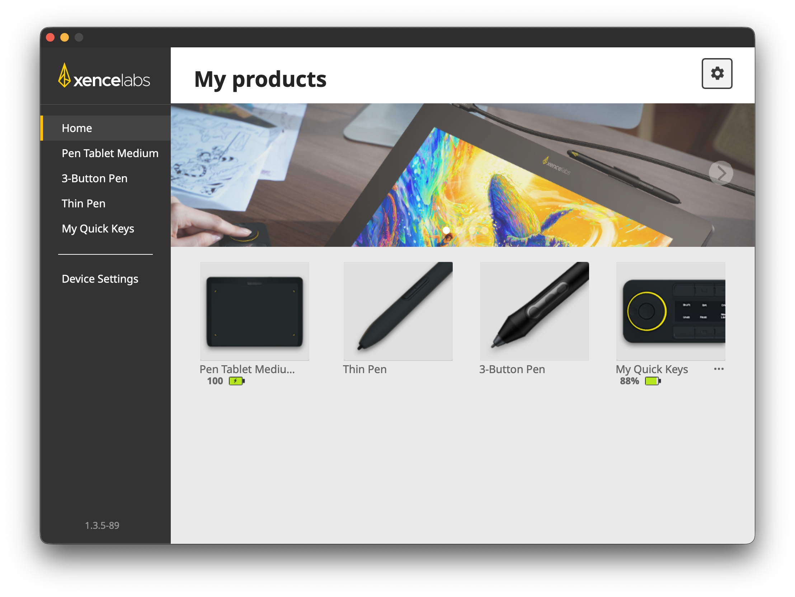

<!-- SPDX-License-Identifier: CC-BY-4.0 -->
<!-- Copyright Contributors to the Xencelabs Settings File Project. -->

# Xencelabs Settings Files

## Overview

This project contains a collection of settings files for the Xencelabs tablet product line. Because of the nature of applications to have user defined hotkeys these settings files should be used as a starting point and customized from there.

## Installation

To install a settings file for an application open the Xencelabs Application. You will see this interface window.

1. Download the settings file you want to install on your computer from this repository.

2. Click on the gear icon 

3.The following popup menu will be display.

4. Navigate to the zip folder on your computer, select it, and press **Install from Disk.

## Reporting an issue or requesting additional Features

Issues and Feature requests should be [reported as an issue](https://github.com/jaymewilkinson/Xencelabs/issues).
